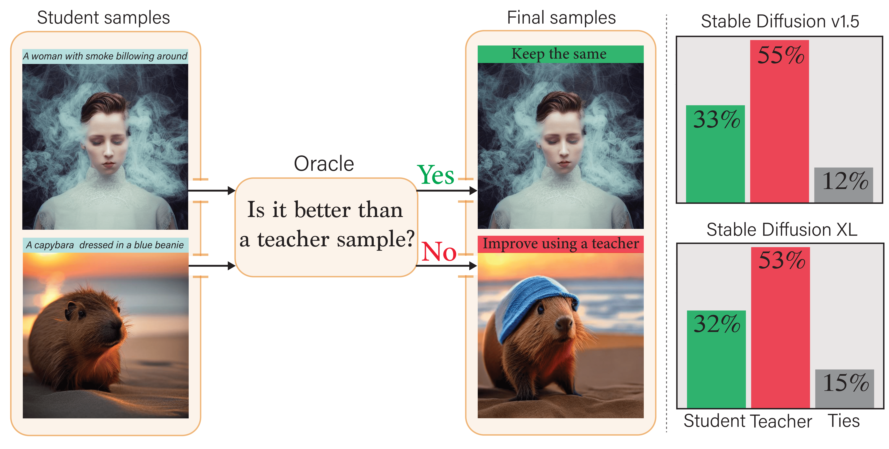
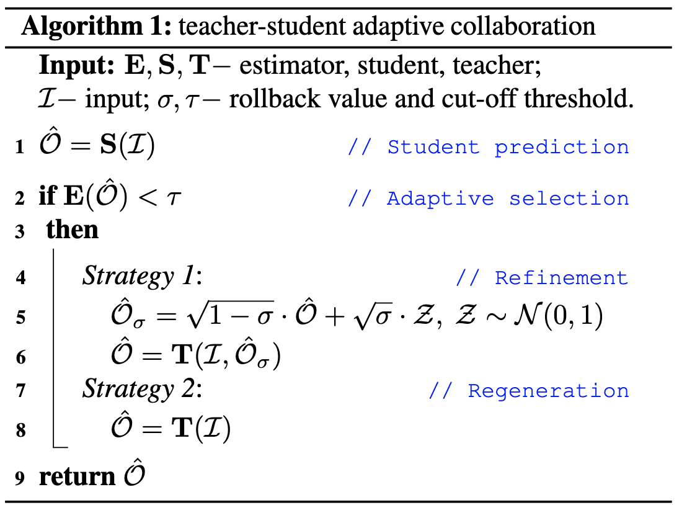
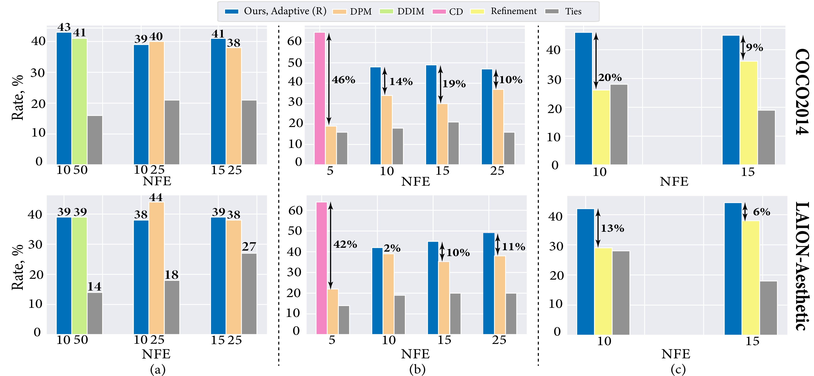
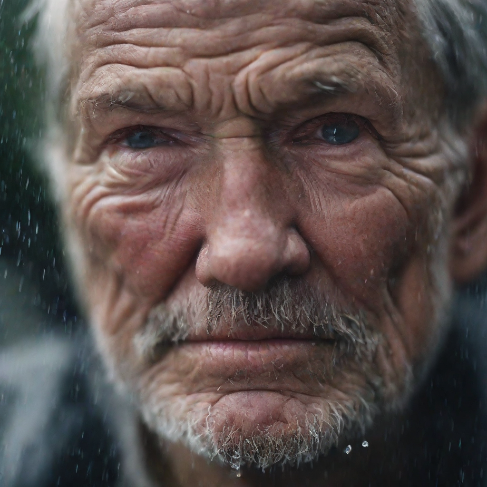

# Your Student is Better Than Expected: </br> Adaptive Teacher-Student Collaboration for Text-Conditional Diffusion Models

[](https://arxiv.org/abs/2312.10835)
## Overview
<p align="center">

</p>

>**Abstract**: <br>
In this work, we investigate the relative quality of samples produced by the teacher text-to-image diffusion model and its distilled student version. 
As our main empirical finding, we discover that a noticeable portion of student samples exhibit superior fidelity compared to the teacher ones, despite the "approximate" nature of the student.
Based on this finding, we propose an adaptive collaboration between student and teacher diffusion models for effective text-to-image synthesis. 
Specifically, the distilled model produces the initial sample, and then an oracle decides whether it needs further improvements with a slow teacher model.

Our approach operates with the following entities: 
1. Models: <i>student</i>, <i>teacher</i> and <i>quality estimator</i>, 
2. Hyperparameters: <i>rollback value</i> (σ) and <i>cut-off threshold</i> (τ)

The algorithm below presents the proposed pipeline, consisting of two adaptive strategies: 
refinement and regeneration.
<p align="center">

</p>

- <i>The rollback value</i> is used in the adaptive refinement strategy and controls
the amount of Gaussian noise applied to the student sample. It can be varied between 0 and 1. Higher σ leads to
more pronounced changes but requires more teacher steps to produce plausible samples.
- <i>The cut-off threshold</i> is necessary to perform adaptive selection. 
Specifically, we define it as a <i>k</i>-th percentile of the selected <i>quality estimator</i>, 
which requires preliminary fine-tuning 
based on your student model and text prompts. 
When τ is tuned, we use it as follows: if the score of the student sample exceeds the threshold, 
we consider this sample superior to the teacher one. 
Otherwise, we perform an improvement step using the teacher.

## Results
The designed pipeline can surpass state-of-the-art text-to-image
alternatives for various inference budgets in terms of human
preference.
<p align="center">

</p>

## Table of contents

* [Installation](#requirements)
* [Text-to-Image. Example 1: LCM-SDXL](#text-to-image-example-1-lcm-sdxl)
* [Text-to-Image. Example 2: SDXL-Turbo](#text-to-image-example-2-sdxl-turbo)
* TODO [How to tune hyperparameters for your task?]()
* TODO [Controllable generation]() 
* TODO [Image2Image translation]() 
* TODO [Paper results reproduction]()
* [Training and inference of consistency distillation for SDv1.5](consistency_models_sd)
* [Citation](#citation)

## Requirements
```shell
# Clone a repo
git clone https://github.com/yandex-research/adaptive-diffusion

# Create an environment and install packages
python3 -m venv ada-diff
source ada-diff/bin/activate
pip3 install -r requirements/req.txt
```

## Text-to-Image. Example 1: LCM-SDXL

<b>Step 1. Specify packages and models </b>
<br /> Here, we consider [LCM-SDXL](https://huggingface.co/latent-consistency/lcm-sdxl) 
and [SDXL-Base](https://huggingface.co/docs/diffusers/using-diffusers/sdxl) as a <i>student</i> and <i>teacher</i>, respectively.
As a <i>quality estimator</i>, we use [ImageReward](https://github.com/THUDM/ImageReward). 
```Python
import torch
import ImageReward as RM

from diffusers import DiffusionPipeline, StableDiffusionXLImg2ImgPipeline
from diffusers import UniPCMultistepScheduler, UNet2DConditionModel, LCMScheduler

# Student
unet = UNet2DConditionModel.from_pretrained(
    "latent-consistency/lcm-sdxl", torch_dtype=torch.float16, variant="fp16"
    )
student = DiffusionPipeline.from_pretrained(
    "stabilityai/stable-diffusion-xl-base-1.0", unet=unet, torch_dtype=torch.float16, variant="fp16"
    ).to("cuda")
student.scheduler = LCMScheduler.from_config(student.scheduler.config)

# Teacher
teacher = StableDiffusionXLImg2ImgPipeline.from_pretrained(
    "stabilityai/stable-diffusion-xl-base-1.0", torch_dtype=torch.float16, variant="fp16", use_safetensors=True
).to("cuda")
teacher.scheduler = UniPCMultistepScheduler.from_config(teacher.scheduler.config)

# Quality estimator
estimator = RM.load("ImageReward-v1.0")
```

<b>Step 2. Configurate the adaptive pipeline </b> 
<br /> In the example, we've already precalculated the ImageReward percentiles for 
LCM-SDXL. This is a ```.json``` file consisting of a dictionary with different percentiles
```{k: value}```, where <i>k</i> in ```[10, 20, 30, 40, 50, 60, 70, 80, 90]```. 


```Python
from adaptive_diffusion import AdaptiveDiffusionPipeline

# It requires three models
pipeline_adaptive = AdaptiveDiffusionPipeline(estimator=estimator,
                                              student=student,
                                              teacher=teacher)

# Loading or calculation of the score percentiles
# The calculation is based on the specified estimator and student
pipeline_adaptive.calc_score_percentiles(file_path='data/IR_percentiles_lcm.json',  # Calculate and save if it doesn't exist
                                         num_inference_steps_student=4,
                                         n_samples=5000)
```

<b>Step 3. Running</b> 
<br> Here, you can select different <i>k</i> and σ. Specifically, 
<i>k</i> determines which part of the student samples requires further improvements. You can choose the threshold based on your inference budget. 
For example, if
```num_inference_steps_student=4```, ```num_inference_steps_teacher=12``` 
and you need the adaptive pipeline to perform ```10``` steps on average, 
then select ```k=50```.
Specifically, the total number of steps  ```4 + 12 * 0.5 = 10```.

This code produces an image with the teacher refinement. The number of steps is ```16```.
```Python
prompt = "Astronaut in a jungle riding a horse"
image = pipeline_adaptive(prompt=prompt,
                          num_inference_steps_student=4,
                          student_guidance=8.0,
                          num_inference_steps_teacher=12,
                          sigma=0.7,
                          k=50,
                          seed=0)
```
<p align="center">

</p>

The teacher is not involved in this case, resulting in ```4``` steps.
```Python
prompt = "A close-up picture of an old man standing in the rain"
image = pipeline_adaptive(prompt=prompt,
                          num_inference_steps_student=4,
                          student_guidance=8.0,
                          num_inference_steps_teacher=12,
                          sigma=0.7,
                          k=50,
                          seed=0)
```
<p align="center">

</p>

## Text-to-Image. Example 2: SDXL-Turbo
<b>Step 1. Specify packages and models </b>
<br /> In this example, we consider [SDXL-Turbo](https://huggingface.co/stabilityai/sdxl-turbo) 
and [SDXL-Refiner](https://huggingface.co/docs/diffusers/using-diffusers/sdxl) as a <i>student</i> and <i>teacher</i>, respectively.
We recommend using SDXL-Refiner for small σ (0.1-0.4) and SDXL-Base for higher ones (0.5-0.8).
```Python
import torch
import ImageReward as RM

from diffusers import AutoPipelineForText2Image, StableDiffusionXLImg2ImgPipeline
from diffusers import UniPCMultistepScheduler

# Student
student = AutoPipelineForText2Image.from_pretrained(
    "stabilityai/sdxl-turbo", torch_dtype=torch.float16, variant='fp16'
).to("cuda")

# Teacher
teacher = StableDiffusionXLImg2ImgPipeline.from_pretrained(
    "stabilityai/stable-diffusion-xl-refiner-1.0", torch_dtype=torch.float16, variant="fp16", use_safetensors=True
).to("cuda")
teacher.scheduler = UniPCMultistepScheduler.from_config(teacher.scheduler.config)

# Quality estimator
estimator = RM.load("ImageReward-v1.0")
```

<b>Step 2. Configurate the adaptive pipeline </b> 
<br /> In the example, we've already precalculated the ImageReward percentiles for 
SDXL-Turbo using prompts from [DiffusionDB](https://huggingface.co/datasets/poloclub/diffusiondb).


```Python
from adaptive_diffusion import AdaptiveDiffusionPipeline

# It requires three models
pipeline_adaptive = AdaptiveDiffusionPipeline(estimator=estimator,
                                              student=student,
                                              teacher=teacher)

# Loading or calculation of the score percentiles
# The calculation is based on the specified estimator and student
pipeline_adaptive.calc_score_percentiles(file_path='data/IR_percentiles_turbo.json',  # Calculate and save if it doesn't exist
                                         num_inference_steps_student=2,
                                         n_samples=5000)
```

<b>Step 3. Running </b> 
<br /> Here 
```num_inference_steps_student=2```, ```num_inference_steps_teacher=4``` 
and ```k=50```.
Then, the average number of steps  ```2 + 4 * 0.5 = 4```.

This example produces an image without the teacher refinement. 
That is, the number of steps is ```2```.
```Python
prompt = "Astronaut in a jungle, cold color palette, muted colors, detailed, 8k"
image = pipeline_adaptive(prompt=prompt,
                          num_inference_steps_student=2,
                          num_inference_steps_teacher=4,
                          sigma=0.3,
                          k=50,
                          seed=0)
```
<p align="center">

</p>

On the other hand, the teacher is involved in this case, resulting in ```6``` steps.
```Python
prompt = "Three dogs sleeping together on an unmade bed"
image = pipeline_adaptive(prompt=prompt,
                          num_inference_steps_student=2,
                          num_inference_steps_teacher=4,
                          sigma=0.3,
                          k=50,
                          seed=0)
```
<p align="center">

</p>

## Citation
```bibtex
@misc{starodubcev2023student,
      title={Your Student is Better Than Expected: Adaptive Teacher-Student Collaboration for Text-Conditional Diffusion Models}, 
      author={Nikita Starodubcev and Artem Fedorov and Artem Babenko and Dmitry Baranchuk},
      year={2023},
      eprint={2312.10835},
      archivePrefix={arXiv},
      primaryClass={cs.CV}
}
```
